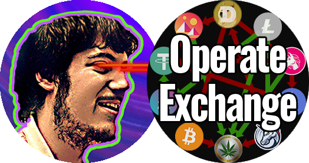

<!--
*** Do a search and replace for the following:
*** EvanGottschalk, OperateExchange, Fort1Evan, magnus5557@gmail.com, OperateExchange, A program for creating simple orders & complex order arrays on cryptocurrency exchanges
-->


<!-- PROJECT SHIELDS -->
<!--
*** I'm using markdown "reference style" links for readability.
*** Reference links are enclosed in brackets [ ] instead of parentheses ( ).
*** See the bottom of this document for the declaration of the reference variables
*** for contributors-url, forks-url, etc. This is an optional, concise syntax you may use.
*** https://www.markdownguide.org/basic-syntax/#reference-style-links
-->
[![Contributors][contributors-shield]][contributors-url]
[![Forks][forks-shield]][forks-url]
[![Stargazers][stars-shield]][stars-url]
[![Issues][issues-shield]][issues-url]
[![MIT License][license-shield]][license-url]
[![LinkedIn][linkedin-shield]][linkedin-url]


<!-- PROJECT LOGO -->
<br />
<p align="center">
  <a href="https://github.com/EvanGottschalk/OperateExchange">
    
  </a>

  <h3 align="center">OperateExchange</h3>

  <p align="center">
    A program for creating simple orders & complex order arrays on cryptocurrency exchanges
    <br />
    <a href="https://github.com/EvanGottschalk/OperateExchange"><strong>Explore the docs »</strong></a>
    <br />
    <br />
    <a href="https://github.com/EvanGottschalk/OperateExchange">View Demo</a>
    ·
    <a href="https://github.com/EvanGottschalk/OperateExchange/issues">Report Bug</a>
    ·
    <a href="https://github.com/EvanGottschalk/OperateExchange/issues">Request Feature</a>
  </p>
</p>


<!-- TABLE OF CONTENTS -->
<details open="open">
  <summary><h2 style="display: inline-block">Table of Contents</h2></summary>
  <ol>
    <li>
      <a href="#about-the-project">About The Project</a>
      <ul>
        <li><a href="#built-with">Built With</a></li>
      </ul>
    </li>
    <li>
      <a href="#getting-started">Getting Started</a>
      <ul>
        <li><a href="#prerequisites">Prerequisites</a></li>
        <li><a href="#installation">Installation</a></li>
      </ul>
    </li>
    <li><a href="#usage">Usage</a></li>
    <li><a href="#roadmap">Roadmap</a></li>
    <li><a href="#contributing">Contributing</a></li>
    <li><a href="#license">License</a></li>
    <li><a href="#contact">Contact</a></li>
    <li><a href="#acknowledgements">Acknowledgements</a></li>
  </ol>
</details>


<!-- ABOUT THE PROJECT -->
## About The Project

The purpose of `OperateExchange` is in its name - most actions a user would take on a cryptocurrency exchange, such as creating or cancelling orders, can be done using this program instead. The advantage of using `OperateExchange` is that users can create groups of dozens of orders, or cancel groups of orders. This allows for more efficient trading than using an exchange's normal interface, which usually only allows users to open or close one order per click.

** *Some exchanges have an API rate limit, which means you can only put in so many orders per time. Read the API limit rules for the particular exchange if you want to use `OperateExchange` to create multiple orders on it.*


### Built With

`Python`

[`CCXT`](https://github.com/ccxt/ccxt) - The fantastic `CCXT` library is critical to this program. Huge thanks to [@kroitor](https://github.com/kroitor) and the many other `CCXT` contributors that made this program possible.

[`ConnectToExchange`](https://github.com/EvanGottschalk/connecttoexchange) - This is another program I wrote for creating the initial connection to a cryptocurrency exchange. You can read more about it here: [github.com/EvanGottschalk/ConnectToExchange](https://github.com/EvanGottschalk/connecttoexchange)

[`GetCurrentTime`](https://github.com/EvanGottschalk/GetCurrentTime) - This program is imported to help collect time data in a legible fashion. It also allows for the translation of time stamps. You can read more about it here: [github.com/EvanGottschalk/GetCurrentTime](https://github.com/EvanGottschalk/GetCurrentTime)

[`AudioPlayer`](https://github.com/EvanGottschalk/AudioPlayer) - This is a simple program for playing custom audio alerts. It can be used with `ConnectToExchange` to warn you if an error occurs. You can read more about it here: [github.com/EvanGottschalk/AudioPlayer](https://github.com/EvanGottschalk/AudioPlayer)

`QuadraticFormula` - This is a simple program for calculating the solutions to a quadratic equation using the quadratic formula.


<!-- GETTING STARTED -->
## Getting Started

### Prerequisites

Before using `OperateExchange`, you must first obtain an API key and secret from the cryptocurrency exchange of their choosing. You also need to install the [`CCXT`](https://github.com/ccxt/ccxt) library.

### Installation

1. Install [`CCXT`](https://github.com/ccxt/ccxt). This can be done in a number of ways. I used `pip`.
   ```sh
   pip install ccxt
   ```
2. Download the `.py` files from this repository (`OperateExchange.py`, `ConnectToExchange.py`, `GetCurrentTime.py`, `QuadraticFormula.py`, and optionally `AudioPlayer.py`)

3. In the same folder as `ConnectToExchange.py`, create a `.txt` file to store your API information. Its name should start with the exchange you are using, followed by an underscore, followed by the name of the account you're using, and ending with `_API.txt`.

  For example, if you are using your **Main** account on **Coinbase**, you would name the `.txt` file **`Coinbase_Main_API.txt`**

  If your API key is `view-only`, you can save your cryptocurrency exchange API key on the 1st line, and your API secret on the 2nd. However, **if your API key has `trade` priveleges, you should save an encrypted version of both your key and secret on those lines instead.**

  To encrypt your API information, I recommend using `CustomEncryptor.py`, which can be downloaded here: [github.com/EvanGottschalk/CustomEncryptor](https://github.com/EvanGottschalk/CustomEncryptor)

4. Run `OperateExchange.py`

5. Congratulations! You can now use `OperateExchange` to create and cancel orders on your chosen cryptocurrency exchange!


<!-- USAGE EXAMPLES -->
## Usage

**Example 1** - Creating an Order

The following code will create a limit order for $100 worth of bitcoin priced at $30,000.

```python
OE = OperateExchange()
OE.createOrder({'Exchange': 'Coinbase', \
                'Symbol': 'BTC/USD', \
                'Side': 'buy', \
                'Amount': '100', \
                'Order Type': 'Limit', \
                'Price': 30000})
```

**Example 2** - Getting a dataframe and CSV of the open, high, low, close & volume values over the 1 minute timeframe

```python
OE = OperateExchange()
OE.getOHLCVs('', 'BTC/USDT', '1m')
```

**Example 3** - Cancel a group of orders to buy or sell bitcoin at prices between $32500 and $37500

```python
OE = OperateExchange()
OE.CTE.connect('Coinbase')
OE.cancelOrderGroup({'Symbol': 'BTC/USD', \
                     'Lowest Cancel Price': 32500, \
                     'Highest Cancel Price': 37500})
```

**Example 4** - Create an array of orders from $30,000 to $29,000 separated by $50 each on Coinbase totalling $100 in value. Since the style is `'Linear'`, the $100 of buying power will be distributed linearly from $30,000 to $29,000, with the largest order at $29,000 and the smallest at $30,000.

```python
OE = OperateExchange()
OE.createArrayOrder({'Exchange': 'coinbase', \
                     'Symbol': 'BTC/USD', \
                     'Side': 'buy', \
                     'Amount': 100, \
                     'Order Type': 'limit', \
                     'Price': 30000}, \
                    {'Granularity': 50, \
                     'Spread': 1000, \
                     'Steepness': 0, \
                     'Minimum Order Size': 1, \
                     'Style': 'Linear'})
```

<!-- ROADMAP -->
## Roadmap

See the [open issues](https://github.com/EvanGottschalk/OperateExchange/issues) for a list of proposed features (and known issues).


<!-- CONTRIBUTING -->
## Contributing

Contributions are what make the open source community such an amazing place to be learn, inspire, and create. Any contributions you make are **greatly appreciated**.

1. Fork the Project
2. Create your Feature Branch (`git checkout -b feature/AmazingFeature`)
3. Commit your Changes (`git commit -m 'Add some AmazingFeature'`)
4. Push to the Branch (`git push origin feature/AmazingFeature`)
5. Open a Pull Request


<!-- LICENSE -->
## License

Distributed under the GNU GPL-3 License. See `LICENSE` for more information.


<!-- CONTACT -->
## Contact

Evan Gottschalk - [@Fort1Evan](https://twitter.com/Fort1Evan) - magnus5557@gmail.com

Project Link: [https://github.com/EvanGottschalk/OperateExchange](https://github.com/EvanGottschalk/OperateExchange)


<!-- ACKNOWLEDGEMENTS -->
## Acknowledgements

* Huge thanks to [@kroitor](https://github.com/kroitor) and the many other [CCXT](https://github.com/ccxt/ccxt) contributors that made this program possible.
* Thanks to [@bartmassi](https://github.com/bartmassi) for working with me to improve the program's security, and for answering numerous other questions, and also for always being a helpful, available, and informative teacher (and friend).

Thinking about contributing to this project? Please do! Your Github username will then appear here.


<!-- MARKDOWN LINKS & IMAGES -->
<!-- https://www.markdownguide.org/basic-syntax/#reference-style-links -->
[contributors-shield]: https://img.shields.io/github/contributors/EvanGottschalk/OperateExchange.svg?style=for-the-badge
[contributors-url]: https://github.com/EvanGottschalk/OperateExchange/graphs/contributors
[forks-shield]: https://img.shields.io/github/forks/EvanGottschalk/OperateExchange.svg?style=for-the-badge
[forks-url]: https://github.com/EvanGottschalk/OperateExchange/network/members
[stars-shield]: https://img.shields.io/github/stars/EvanGottschalk/OperateExchange.svg?style=for-the-badge
[stars-url]: https://github.com/EvanGottschalk/OperateExchange/stargazers
[issues-shield]: https://img.shields.io/github/issues/EvanGottschalk/OperateExchange.svg?style=for-the-badge
[issues-url]: https://github.com/EvanGottschalk/OperateExchange/issues
[license-shield]: https://img.shields.io/github/license/EvanGottschalk/OperateExchange.svg?style=for-the-badge
[license-url]: https://github.com/EvanGottschalk/OperateExchange/blob/master/LICENSE.txt
[linkedin-shield]: https://img.shields.io/badge/-LinkedIn-black.svg?style=for-the-badge&logo=linkedin&colorB=555
[linkedin-url]: https://linkedin.com/in/EvanGottschalk
